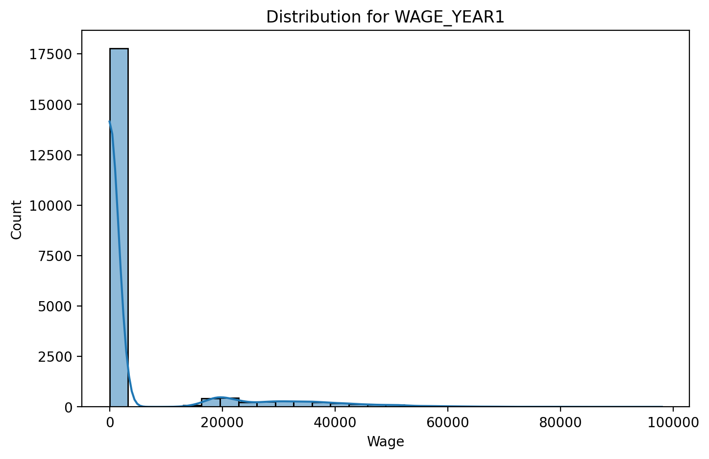
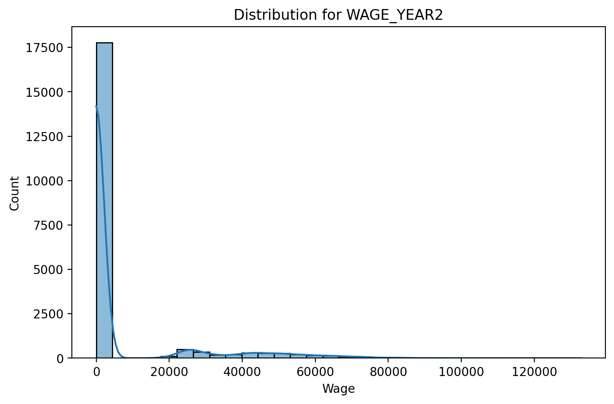
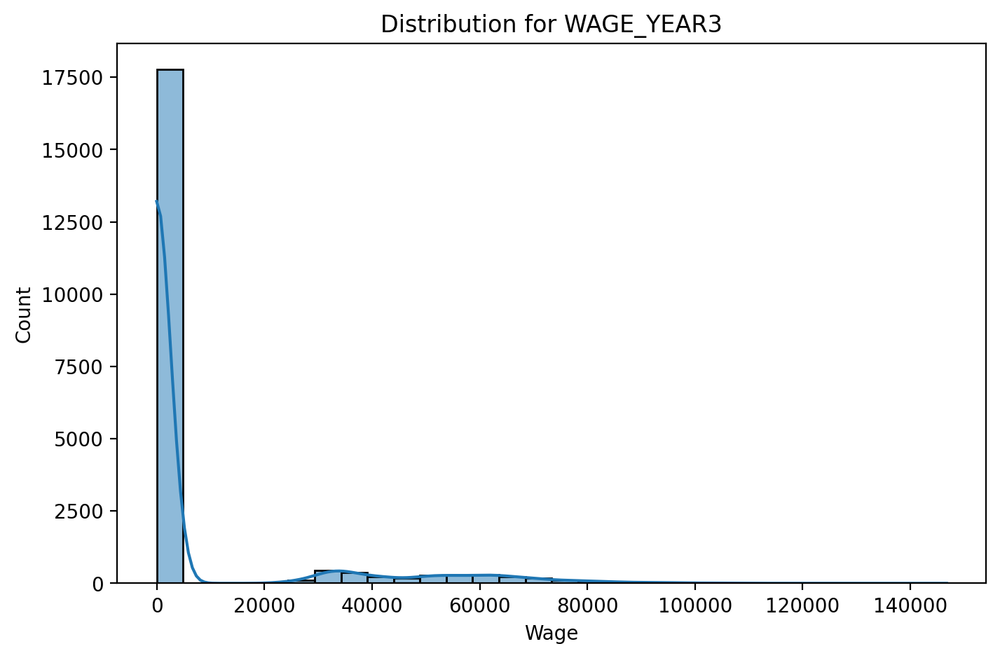
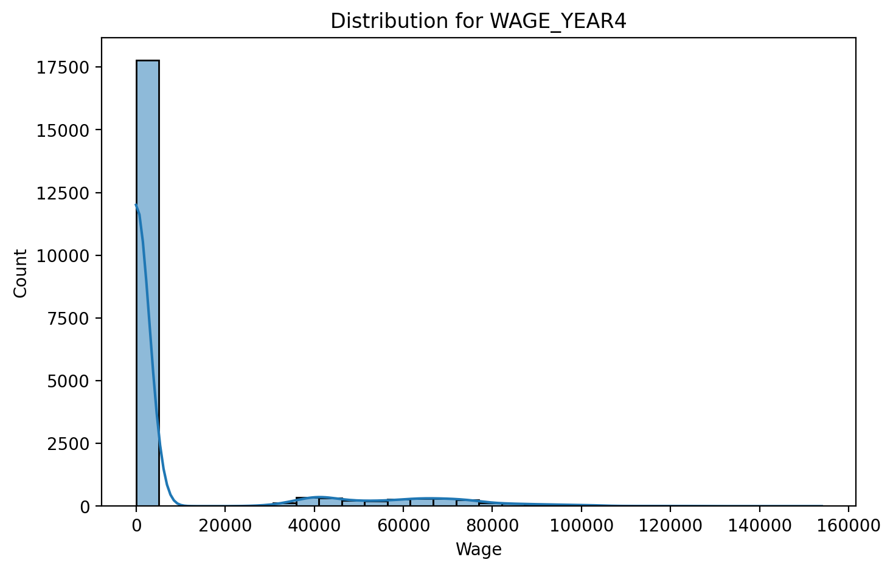
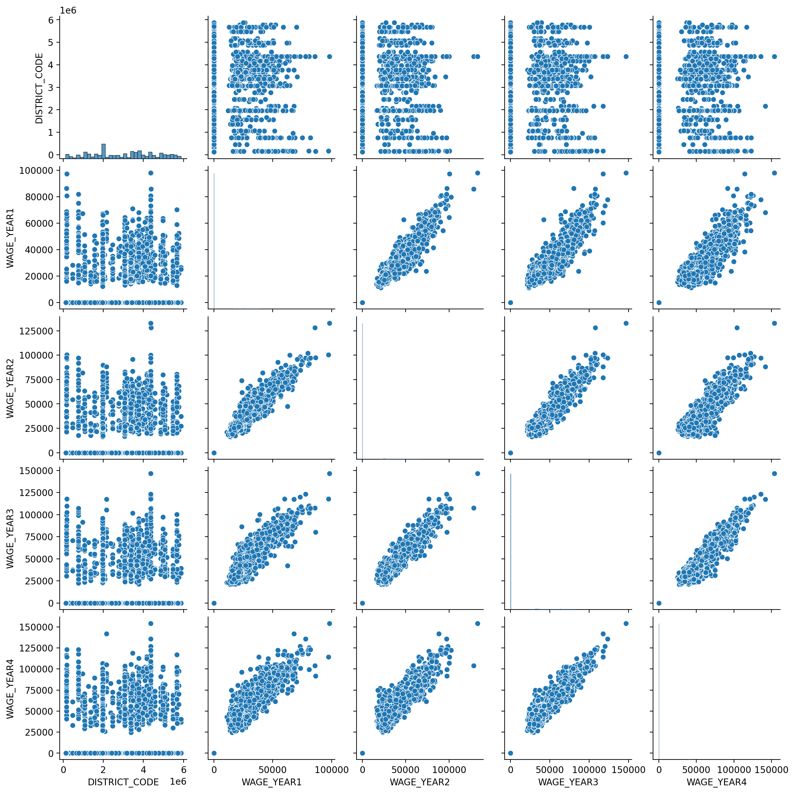
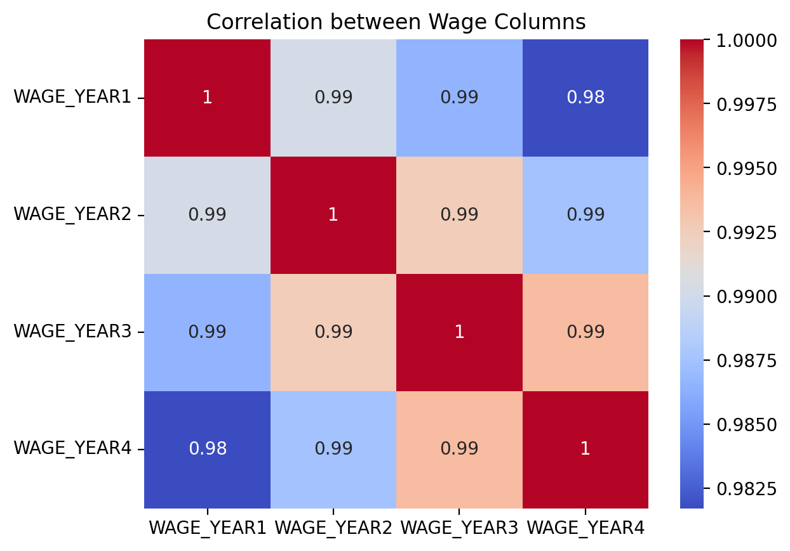
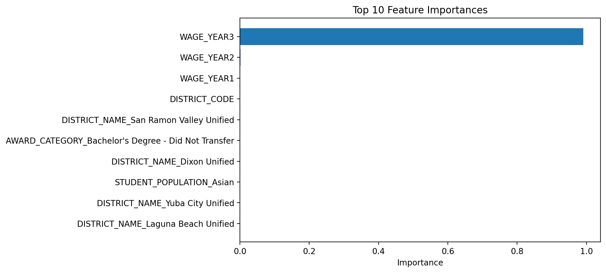

# 362-data-challenge-student-pathways

## Part 1 - Data Exploration

#### Data Quality
1. For each feature, what is the data type? 
    - ```DISTRICT_TYPE```, ```DISTRICT_NAME```, ```ACADEMIC_YEAR```, ```DEMO_CATEGORY```, ```STUDENT_POPULATION```, ```AWARD_CATEGORY``` are the 6 features with object type values.
    - ```DISTRICT_CODE```, ```WAGE_YEAR1```, ```WAGE_YEAR2```, ```WAGE_YEAR3```, ```WAGE_YEAR4``` are features with float64 values.
2. Is there any missing data?   
    - There is one column with missing data which is the ```DISTRICT_CODE``` column. It only has 17960 out of the total 20705 values in it.

#### Range
1. What are the unique values for each categorical column?   
The unique values for each categorical column are as follows:
    - ```DISTRICT_TYPE```: 3 unique district types - School District, Legislative District, All                        
    - ```DISTRICT_NAME```: 692 unique districts like Southern Trinity Joint Unified, Trinity County Office of Education, and so on.
    - ```ACADEMIC_YEAR```: 2018-2019
    - ```DEMO_CATEGORY```: 5 unique categories - Race, Foster Status, Homeless Status, Gender, All
    - ```STUDENT_POPULATION```: 15 unique population groups - None Reported, American Indian or Alaska Native, Native Hawaiian or Other Pacific Islander, Foster Youth, Two or More Races, Black or African American, Experienced Homelessness in K-12, Asian, All, Male, Female, White, Hispanic or Latino, Not Foster Youth, Did Not Experience Homelessness in K-12
    - ```AWARD_CATEGORY```: 4 unique award categories - Bachelor's Degree (Transferred), Bachelor's Degree (Did Not Transfer), Community College Certificate, Associate Degree
2. What is the range of values of the numeric columns? 
    - ```DISTRICT_CODE```: 1.100170e+05 to 5.872769e+06
    - ```WAGE_YEAR1```: 0 to 97993
    - ```WAGE_YEAR2```: 0 to 132847
    - ```WAGE_YEAR3```: 0 to 146728
    - ```WAGE_YEAR4```: 0 to 153910
3. Are the numeric column values normally distributed?
    - They are not normally distributed.
    - They have a heavy right skew
    - Most values cluster up around 0 on the left side of the curve.  

      
      
      
    


#### Semantics
1. What is the meaning of the columns? 
    - District information like type of district, name and code of the district is shown through features ```DISTRICT_TYPE```, ```DISTRICT_NAME```, ```DISTRICT_CODE```.
    - Wages over 4 years are shown through ```WAGE_YEAR1```, ```WAGE_YEAR2```, ```WAGE_YEAR3```, ```WAGE_YEAR4```.
    - ```ACADEMIC_YEAR```, ```DEMO_CATEGORY```, ```STUDENT_POPULATION``` tells us about the academic year and the demography.
    - ```AWARD_CATEGORY``` reflects 4 unique award categories like Bachelors's Degree, Transferred, Community College, Associate Degree

2. Are any columns related to other columns? 
    - Strong positive relationship between the wage columns
    - As wages increase in one year, they tend to increase in the other years too.
    - From the pairplot, we can say that the 4 wage year columns show a clear upward linear pattern.
    - Doesn't seem to have much correlation with district code.  
    
 
    

## Part 2 - Build a model to predict ```WAGE_YEAR4```
Python notebook [here](https://github.com/USF-AI-Fall-2025/assignment-05-data-challenge-1-chansrinivas/blob/main/CS%20x62%20-%20Assignment%205%20-%20Data%20Challenge%201.ipynb).

## Part 3 - Reflection
1. Which features best predict the target outcome (WAGE_YEAR4)?
    - ```WAGE_YEAR3``` has an importance score of ≈ 0.99, meaning it explains almost all of the predictive power for ```WAGE_YEAR4```
    - This makes sense because wages across consecutive years are highly correlated
    - ```WAGE_YEAR2``` and ```WAGE_YEAR1``` have very small importance values
    - Other features like ```DISTRICT_CODE```, ```DISTRICT_NAME```, ```AWARD_CATEGORY```, and ```STUDENT_POPULATION``` have extremely low importances, almost close to zero.

```python
                                               Feature  Importance
3                                           WAGE_YEAR3    0.990935
2                                           WAGE_YEAR2    0.001347
1                                           WAGE_YEAR1    0.001294
0                                        DISTRICT_CODE    0.000858
541             DISTRICT_NAME_San Ramon Valley Unified    0.000329
721  AWARD_CATEGORY_Bachelor's Degree - Did Not Tra...    0.000234
209                        DISTRICT_NAME_Dixon Unified    0.000215
707                           STUDENT_POPULATION_Asian    0.000194
696                    DISTRICT_NAME_Yuba City Unified    0.000131
312                 DISTRICT_NAME_Laguna Beach Unified    0.000116
```

2. What does your model say about the people or populations whose data is provided?
    - If a person had a high wage in year 1, his/her wage likely grew every year so higher previous wages means higher future wages for the population whose data is provided.
    -  ```ACADEMIC_YEAR```, ```DEMO_CATEGORY``` or ```STUDENT_POPULATION``` seem to have no effect on the wages and hence are the least important features in the model.
3. What features, if any, would you like to have had to make a better model?
    - Having features like cost of living in each district or the work experience a person has could be help in making a better model.
    
